# Jarkom-Modul-1-2026-K-62

| Nama | NRP |
| --- | --- | 
| Daffa Ulhaq Fadhlurrahman | 5027251033 | 
| Michiko Artika Satriyo | 5027251105 | 

### 1. 
prefix: 192.242.xx
netmask subnet: /24 (255.255.255.0)

Sehingga:
| Switch | IP |
| --- | --- | 
| switch1 | `192.242.1.0/24` | 
| switch2 | `192.242.2.0/24` | 
| switch3 | `192.242.3.0/24` |

Gateway menjadi:
| gateway | IP |
| --- | --- | 
| eth1 | `192.242.1.1` | 
| eth2 | `192.242.2.1` | 
| eth3 | `192.242.3.1` |

Aturan alokasi IP host pada subnet /24 di rentang .2 hingga .254.

switch1:    
    
Alice `192.242.1.2/24` -> host addr pertama setelah gateway `192.242.1.1`
         
Mika  `192.242.1.3/24` 

switch2:

Chisa `192.242.2.2/24`

switch3:

Knights `192.242.3.2/24`

Eiri `192.242.3.3/24`

```bash
iptables -t nat -A POSTROUTING -o eth0 -j MASQUERADE -s 192.242.0.0/16
```

`/16` subnet mask mencakup seluruh rentang `192.242.0.0` hingga `192.242.255.255`
semua client diizinka melewati router Lain untuk mengakses jaringan luar/internet. 

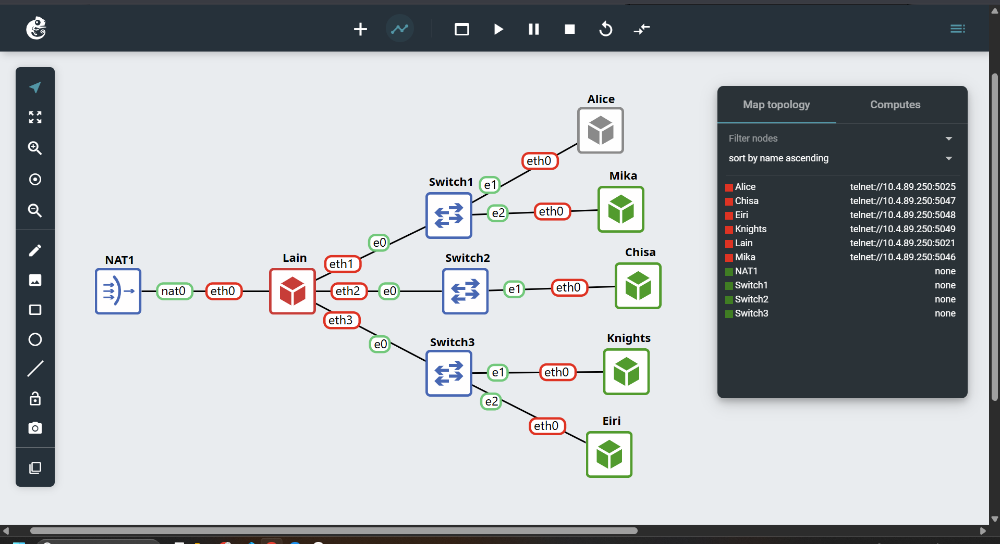

### 2.

```bash
# 1. Mengaktifkan interface eth0
ip link set eth0 up

# 2. Menetapkan alamat IP pada eth0
ip addr add 192.168.122.100/24 dev eth0 2>/dev/null || true

# 3. Menetapkan Default Route ke Gateway Luar
ip route replace default via 192.168.122.1 dev eth0
```
script ```router_config.sh```

Mengapa IP 192.168.122.100 gateway 192.168.122.1? 
node NAT bawaan GNS3 umumnya pakai libvirt/virbr0 yang jalan pada subnet default `192.168.122.0/24`.

IP `192.168.122.1` ini gateway yang memberi jalur keluar ke internet asli PC
`192.168.122.100` jadi IP statis router Lain yang masih satu subnet dengan gateway itu agar tidak terjadi IP conflict.

`2>/dev/null || true` agar saat script dijalanan berkali-kali, terminal tidak mengeluarkan pesan error. 
```ip route replace``` memstikan rute default terganti mengarah ke gateway luar `19.2.168.122.1`

testing:
```bash
# Cek IP dan route sudah terpasang
ip -br a show eth0
ip route show
# Output: eth0 UP 192.168.122.100/24


# Cek konektivitas ke gateway host dan ke internet publik
ping -c 2 192.168.122.1
ping -c 2 8.8.8.8
# Output: 2 packets transmitted, 2 received, 0% packet loss
```

### 3. 

```bash
# Mengaktifkan IP Forwarding di Linux kernel
sysctl -w net.ipv4.ip_forward=1
```
script `router_config.sh`

Pada tiap client (contoh si Alice)
```bash
# Menentukan gateway agar paket keluar switch dilempar ke router
ip route add default via 192.242.1.1
```

router directly connected ke 3 subnet via eth1, eth2, dan eth3. Otomatis kernel Linux memiliki tabel rute lokal untuk ketuga segemn tersebut.
Namun setelah script dimatikan, fungsi meneruskan paket demi keamanan. 

testing: 
run `router_config.sh`, outputnya akan bernilai `=1`
buka terminal Alice, lalu command ```ping -c 2 192.242.2.2``` (Chisa) ourputnya `0% packet loss` tanda berhasil.

### 4. 

``` bash
# mengosongkan rule firewall lama agar tidak coflict atau duplicate aturan
iptables -F
iptables -t nat -F

# pasang aturan pada tabel NAT di tahap post-routing (paket harus keluar lewat interface eth0)
iptables -t nat -A POSTROUTING -o eth0 
# ganti IP private client pengirim jadi IP interface eth0 router secara dinamis
-j MASQUERADE 
# menentukan sumber jaringan yang diizinkan
-s 192.242.0.0/16
```
script `router_config.sh`

Berikut percobaan untuk tiap client:

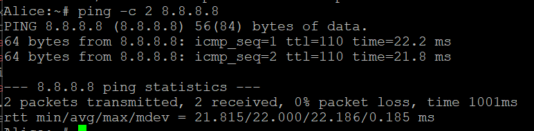

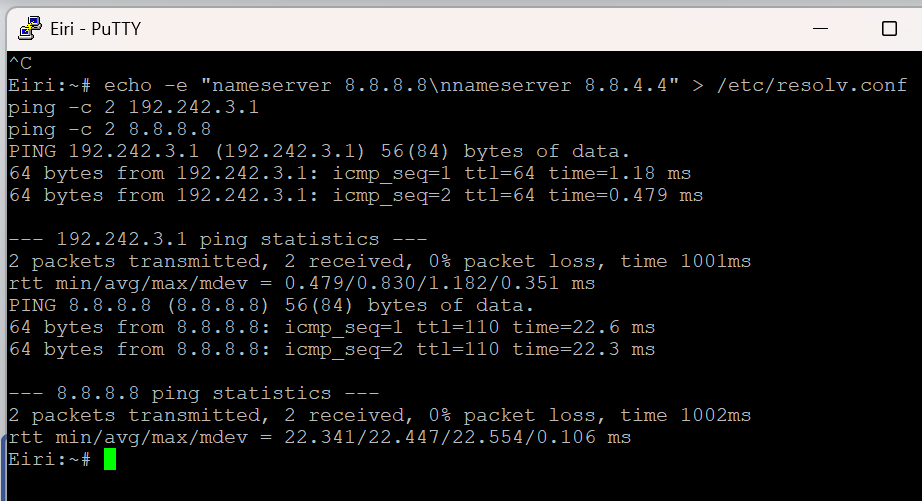

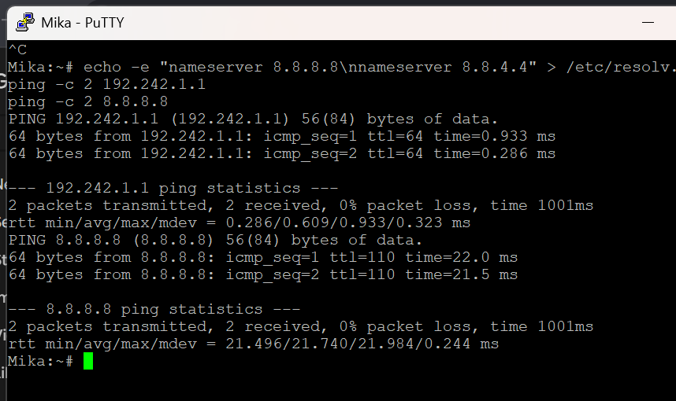

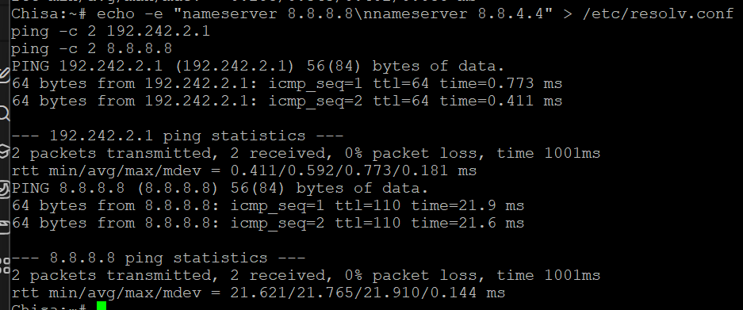

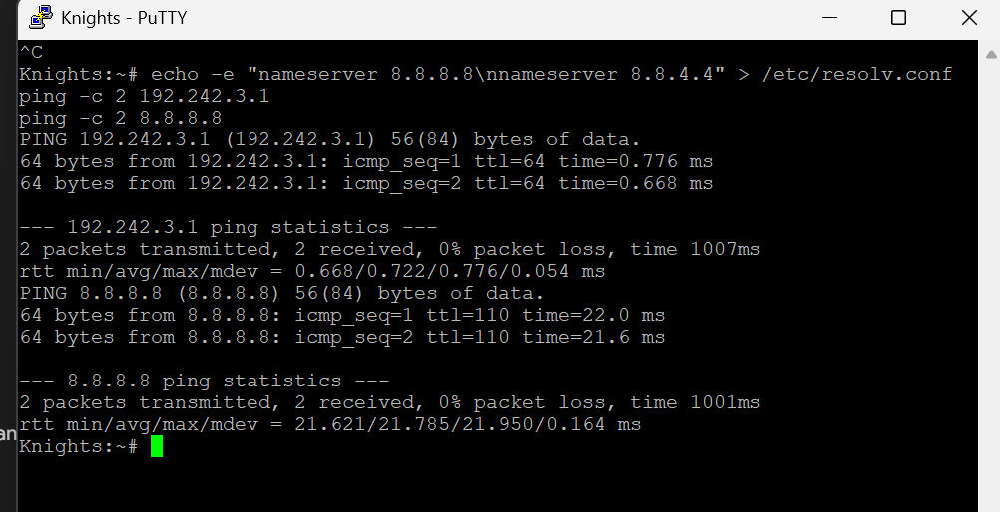

Dapat juga testing dengan command: ```ping -c 2 google.com```

### 5. 

`cek_status.sh`
``` bash
#!/bin/bash

# bried addr: ringkasan eth0-3, status link, dn alamat IP
ip -br a

# buka tabel NAT, tampilin semua rule, menunjukkan informasi lalu lintas paket
# memastikan aturan masquerade di chain postroitng untuk subnet IP 0.0 tetap aktif.
iptables -t nat -L -v -n
```

run script `cek_status.sh` 

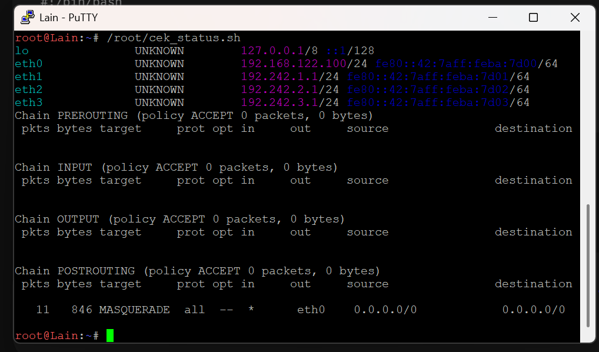

### 6.

Pertama, praktikan perlu mengunduh file yang disediakan asisten, kemudian menyalin isinya ke file `traffic_protocol7.sh` yang ada di `terminal node Mika`.

Kemudian, pada topologi jaringan yang telah dibuat di GNS3, kita perlu mengaktifkan "Start Capture" pada kabel yang menghubungkan Switch dengan node Mika. Jika sudah, maka  logo kaca pembesar akan muncul.


Kemudian, jalankan `traffic_protocol.sh` untuk membuat traffic.


Di Wireshark, gunakan filter `dns || icmp` untuk melacak package yang diminta sesuai soal.


### 14.
### 14.1 What is the IP address of the attacker performing the brute force attack?
Dengan menggunakan fitur endpoints yang mengagregasi ribuan paket menjadi daftar alamat host unik (L3/IPv4) dan port layanan (L4/TCP).

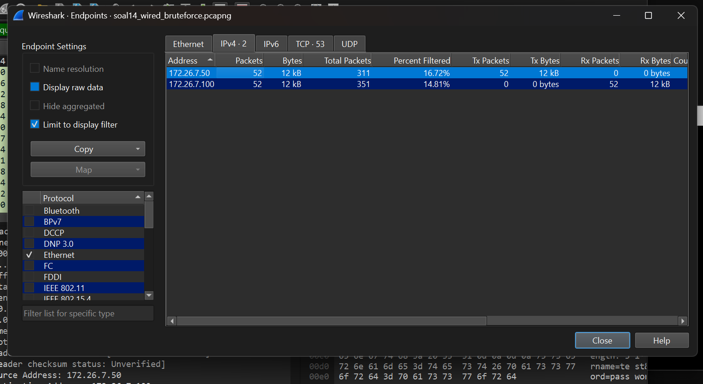

Pada IP `172.26.7.50` terlihat bahwa Tx Packets paling dominan karena menyajikan file web, script, atau gambar ke klien. Maka IP itulah targetnya. 


### 14.2 What is the target IP and port being attacked?
Kebalikan dari IP target sebelumnya,, IP `172.26.7.100` menunjukkan paling aktif mengirim permintaan (Rx Packets) ke arah server target. Dan dengan melihat detail dari Ip tersebut didapatkan port nya `8080`.

### 14.3 What is the password found for the user lain_admin?

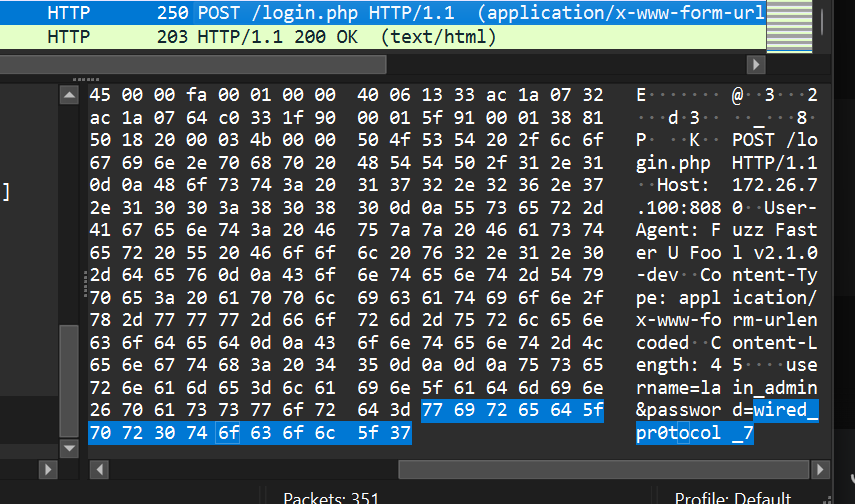

Dari packet list tersebut didapatkan password nya.

### 14.4 What is the web server software and version reported in the response header?

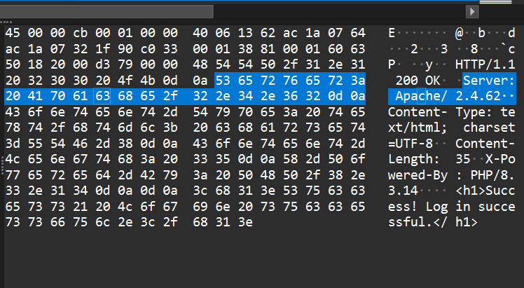

Dengan menggunakan fitur pencari (ctrl + F) didapatkan server software dan versi nya.

### 14. Flag 
Dari kumpulan jawaban tersebut:

172.26.7.50

172.26.7.100:8080

wired_pr0tocol_7

Apache/2.4.62

Maka didapatkan flag: KOMJAR26{W1r3d_Brut3_ofGWOszZFdRWl2gbaXEJsvORj}

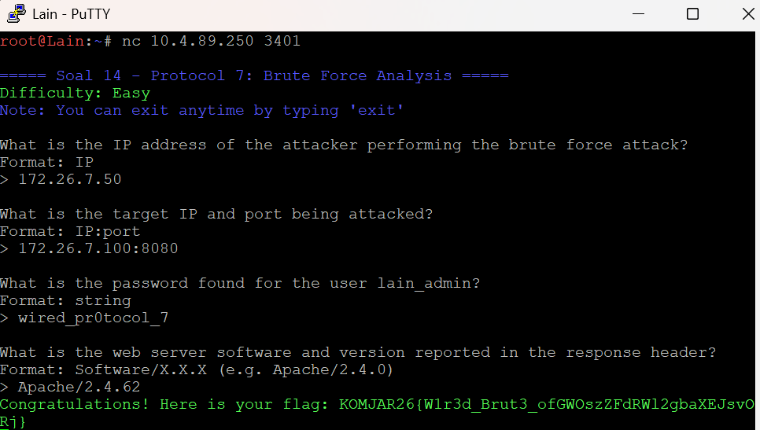


## 15.
### 15.1 What is the vendor ID of the captured USB HID device?
Melalui packet `GET DESCRIPTOR Response DEVICE`, didapatkan idVendor dan idProduct nya.

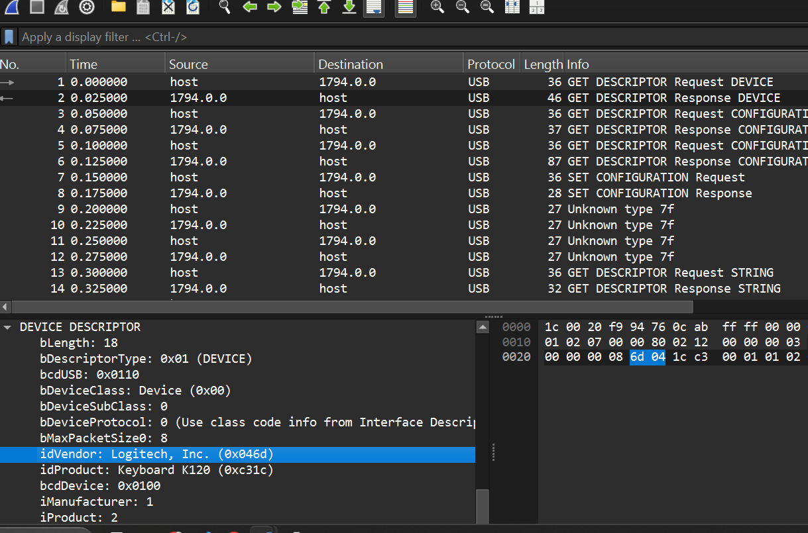

### 15.2 What is the Product ID of the captured USB HID device?
ID ini didapatkan bersamaan dengan ID vendor.

### 15.3 What is the USB device address assigned to the keyboard?

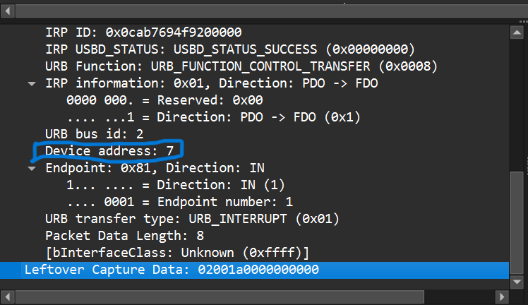

### 15.4 What is the secret message decoded from the captured keystrokes?
Pada packet list dengan info `INTERRUPT`, terdapat leftover captured data. Dari situ saya gunakan tshark `"[path tshark]" -r "[path soal 15]" -Y "usb.transfer_type == 0x01 && frame.len == 35" -T fields -e usb.capdata` 

keystroke data yang didapat melalui filter tersebut:

02001a0000000000
0000000000000000
00000c0000000000
0000000000000000
0000150000000000
0000000000000000
0000080000000000
0000000000000000
0000070000000000
0000000000000000
02002d0000000000
0000000000000000
0200130000000000
0000000000000000
0000150000000000
0000000000000000
0000120000000000
0000000000000000
0000170000000000
0000000000000000
0000120000000000
0000000000000000
0000060000000000
0000000000000000
0000120000000000
0000000000000000
00000f0000000000
0000000000000000
02002d0000000000
0000000000000000
0000240000000000
0000000000000000
02002d0000000000
0000000000000000
00000c0000000000
0000000000000000
0000160000000000
0000000000000000
02002d0000000000
0000000000000000
0000040000000000
0000000000000000
00000f0000000000
0000000000000000
00000c0000000000
0000000000000000
0000190000000000
0000000000000000
0000080000000000
0000000000000000
02002d0000000000
0000000000000000
00001f0000000000
0000000000000000
0000270000000000
0000000000000000
00001f0000000000
0000000000000000
0000230000000000
0000000000000000

Data tersebut merupakan kode hesadesimal. Kemudian decoded keystrokes nya dan mendapatkan secret message `Wired_Protocol_7_is_alive_2026`

### 15. Flag
Dari kumpulan jawaban tersebut:

0x046d

0xc31c

7

Wired_Protocol_7_is_alive_2026

Maka didapatkan flag: KOMJAR26{USB_K3ystr0k3_zWwnYRYEEQXKwDvQBtrYQ0mHf}

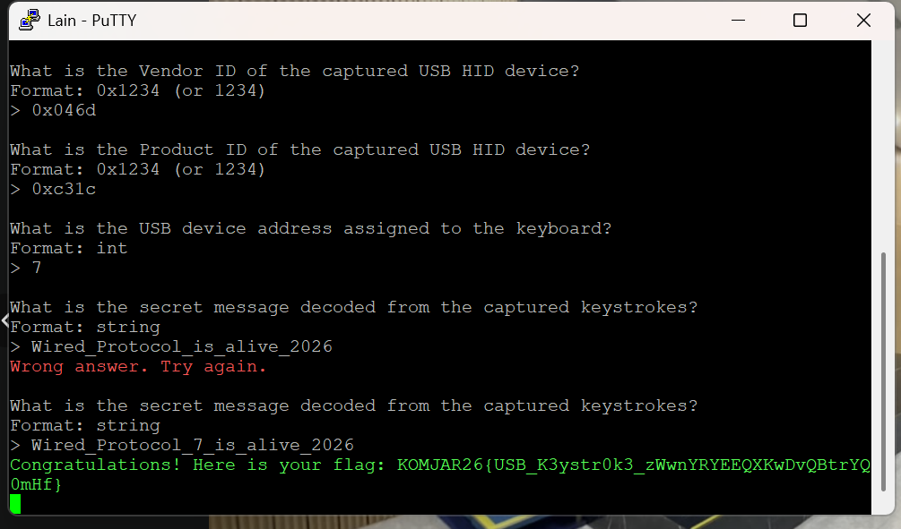


## 16. 
### 16.1 What is the IP address of the FTP server used to download the malware?
Dengan filter `ftp.response.code == 220` didapatkan IP `198.51.100.7` pada `wired-drop FTP server`

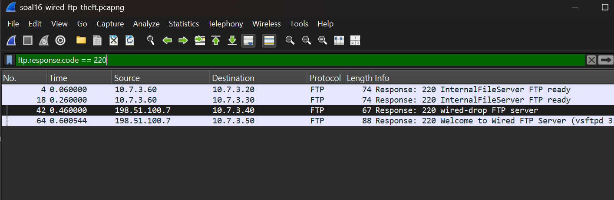

### 16.2 What FTP server software banner is returned upon connection?
Pada packet di bawah gambar 16.1 (`Welcome to Wired FTP Server) terdapat info FTP server nya.

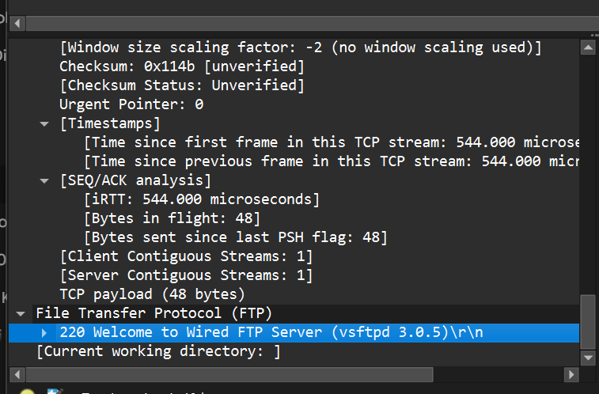

### 16.3 What credential did the attacker use to log in to the FTP server?

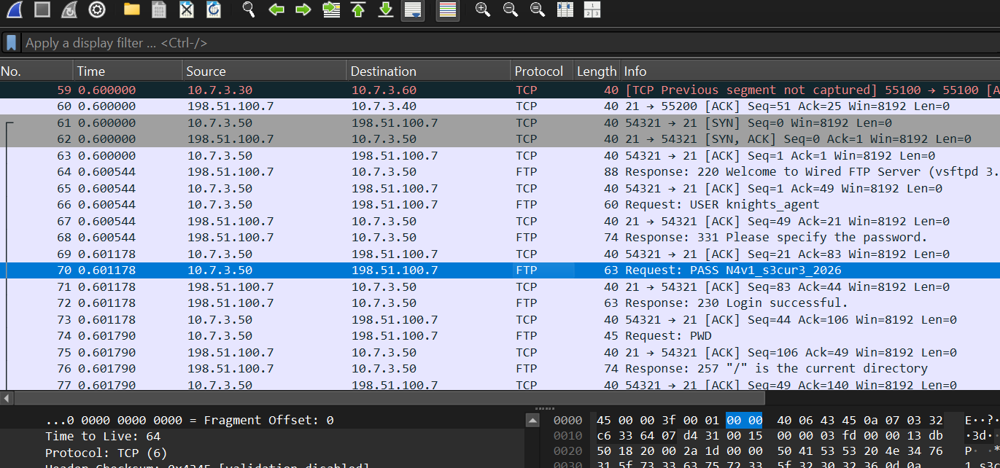

### 16.4 What is the size in bytes of the malware file (knights_payload.exe) requested via FTP?

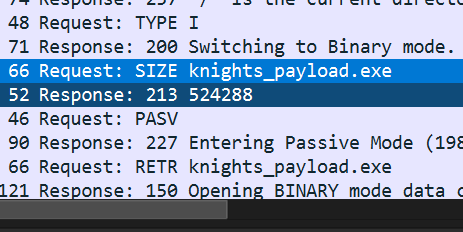

### 16. Flag
Dari kumpulan jawaban tersebut:

198.51.100.7

vsftpd 3.0.5

knights_agent:N4v1_s3cur3_2026

524288

Maka didapatkan flag: KOMJAR26{FTP_Th3ft_R2ezQCoEsXG66qwXkkMeQTanq}

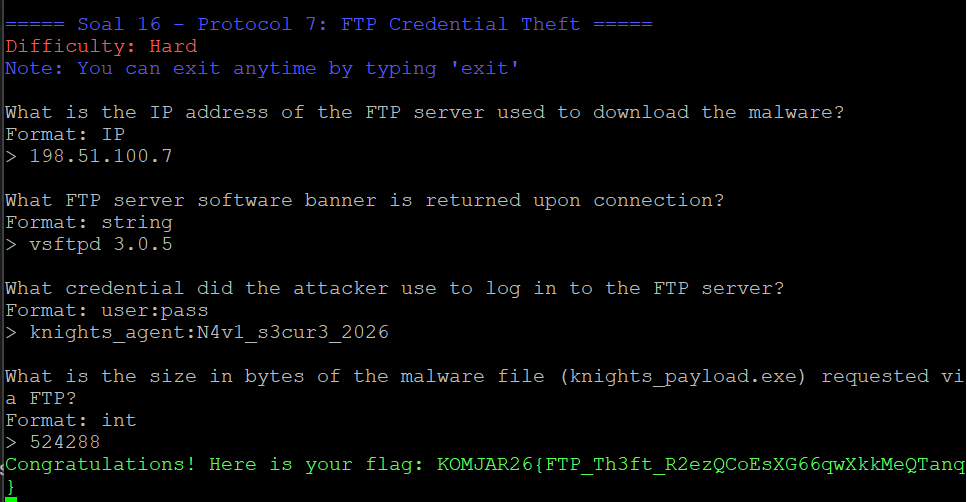


## 17.
### 17.1 What is the domain name (Host) where the suspicious files were downloaded from?
Menggunakan filter `http.request.method == "GET"` didapatkan domain nya.
Aktivitas mengambil atau download berkas selalu diawali oleh klien menggunakan metode `GET`.

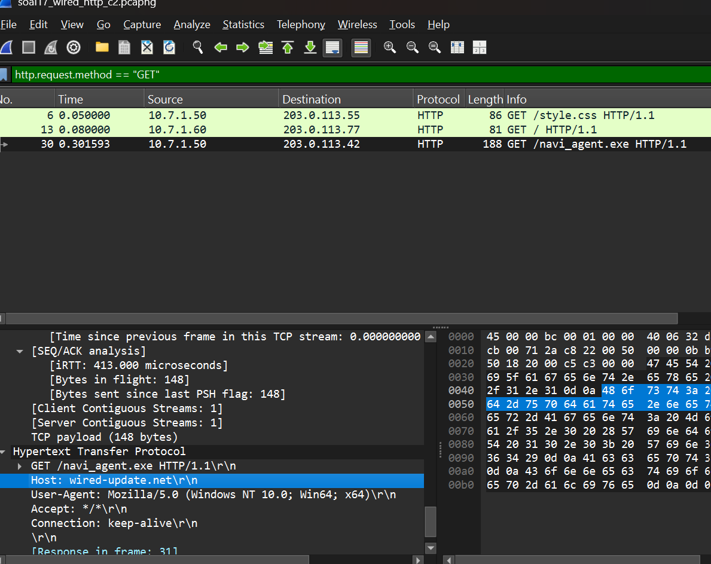

### 17.2 What is the IP address of the web server hosting the malicious files?
Dari packet yang didapatkan melalui filter `GET` tersebut, didapatkan informasi untuk menjawab pertanyaan ini.

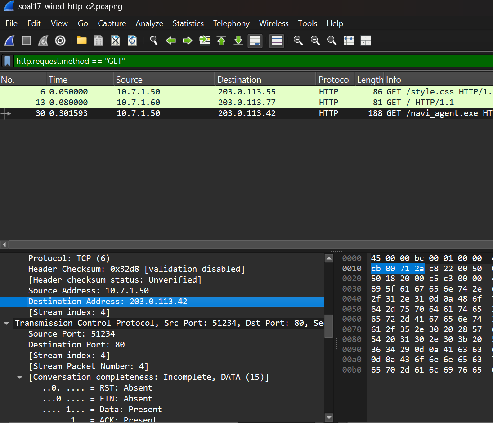

### 17.3 What is the filename of the executable malware payload downloaded by the client?
Packet tersebut juga memberi informasi nama file nya. 

### 17.4 What is the HTTP status response code returned when downloading navi_agent.exe?
Di bawah packet `GET` bisa didapatkan statusnya.

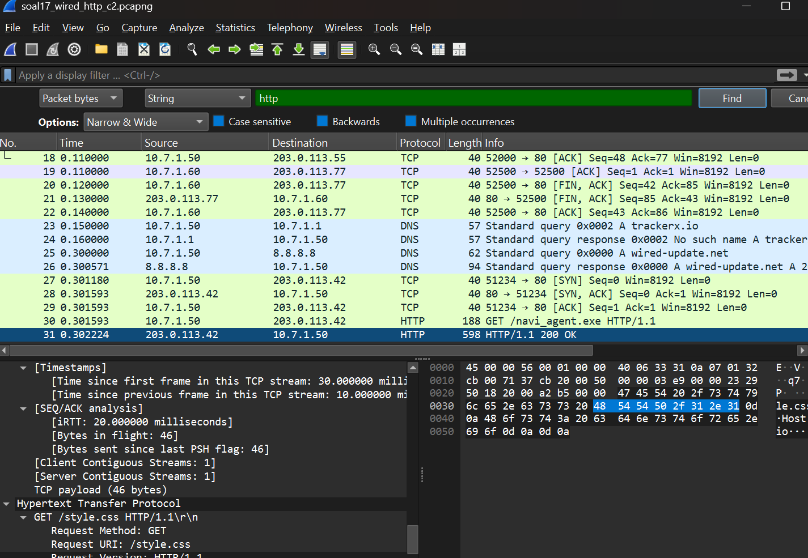

### 17. Flag
Dari kumpulan jawaban tersebut:

wired-update.net

203.0.113.42

navi_agent.exe

200

Maka didapatkan flag: KOMJAR26{Navi_C2_D0wnl04d_uApWZjAmB2PSUAqwE8pqLXhom}

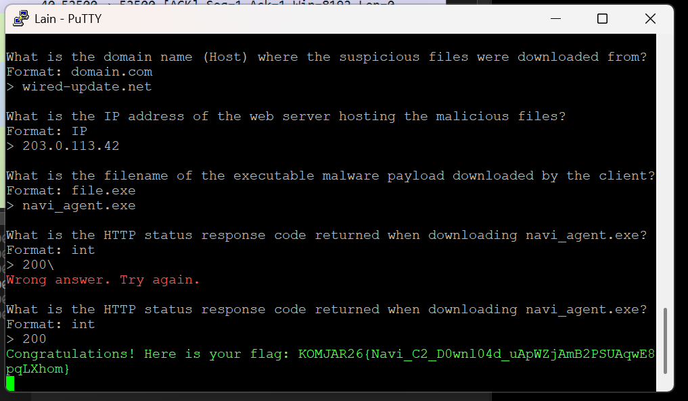
 

## 18.
### 18.1 What network file sharing protocol was used to transfer the malware to the victim?

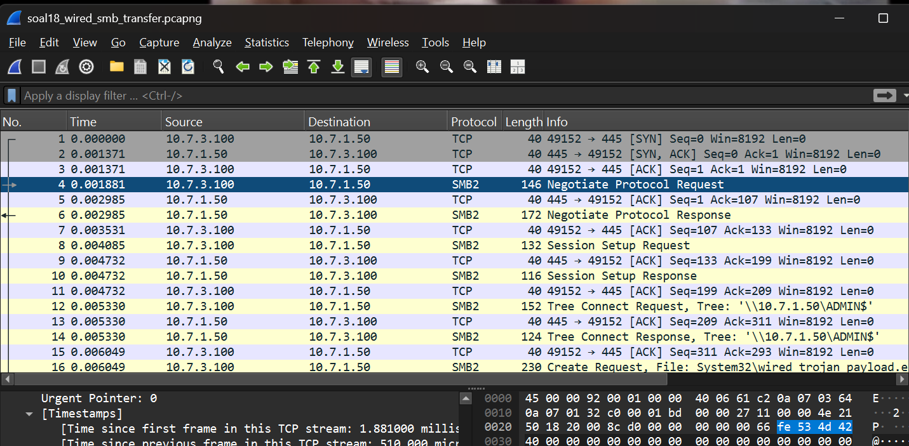

### 18.2 What is the IP address of the source host delivering the malware?
Melalui operasi tree connect `smb2.cmd == 3` bisa memastikan source IP penginisiasi koneksi adakag host yang mengirim malware. 

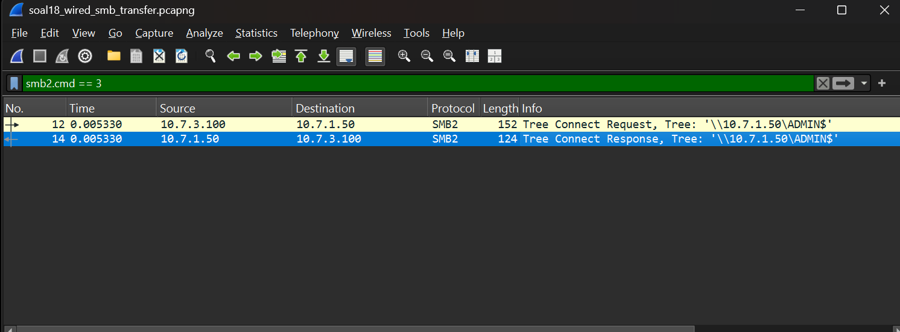

### 18.3 What is the IP address of the victim host receiving the malware?
Setelah terhubung (pada 18.2) proses peletakan malware ke disk dilakukan dengan operasi `smb2.filename` dan penulisan byte payload `smb2.cmd == 9`. Destination Ip pada write request adalah mesin target yang menerima malware. 

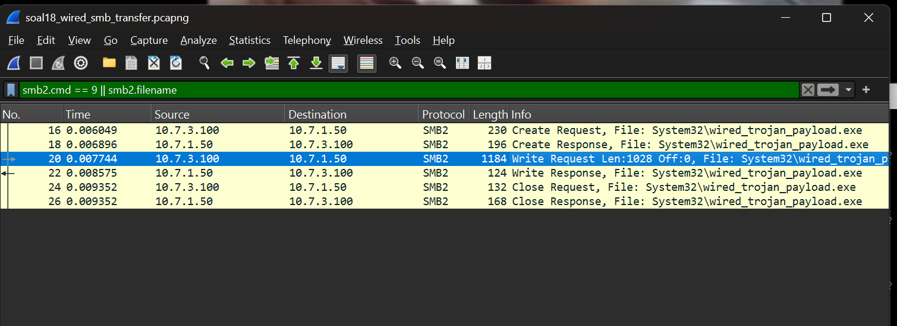

### 18.4 What target share or directory on the victim was the malware written to?
Pada packet yang ditemukan di 18.2 tertera jawabannya.

### 18.5 What is the filename of the exevutable malware transferred?
pada packet yang ditemukan di 18.3, terdapat filename nya. 

### 18. Flag
Dari kumpulan jawaban tersebut:

SMB2

10.7.3.100

10.7.1.50

ADMIN$

wired_trojan_payload.exe

Maka didapatkan flag: KOMJAR26{SMB_Tr4nsf3r_Tssoap3oiw7cU1I0Eq7fldJSv}

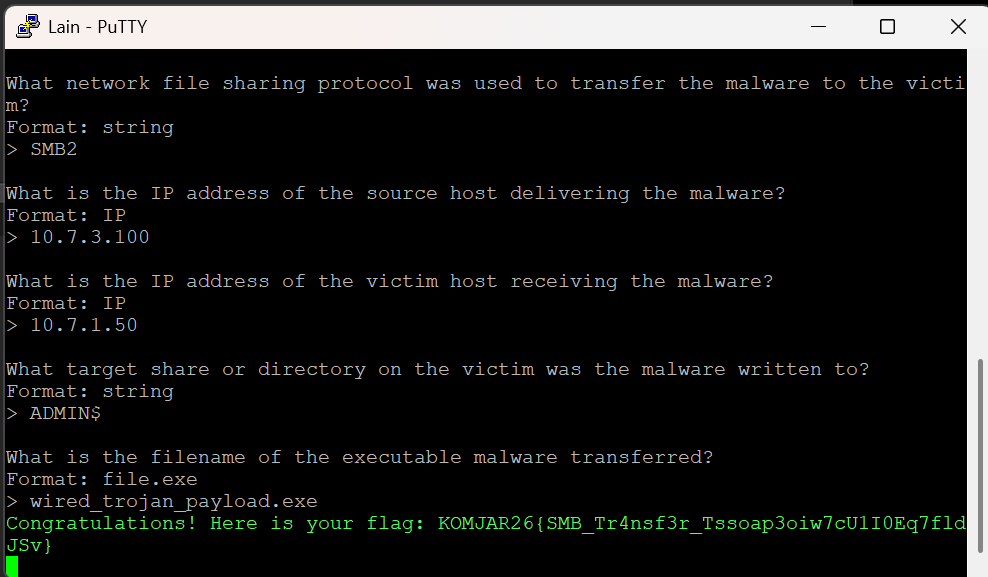


## 19.
### 19.1 What is the email address of the victim targeted by the extortionist?
Fokus pada email, maka protokol transport pengiriman email yang dianalisis adalah SMTP. filter `contains "compromised"` bertujuan untuk mengisolasi paket yang memuat pesan ancaman spesifik dari pemerasan. 

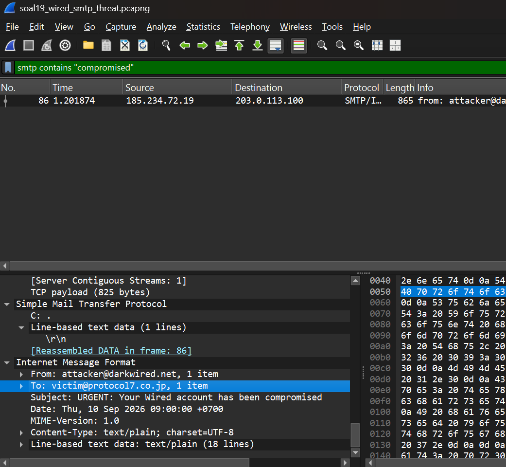

### 19.2 What password did the extortionist claim was stolen from the victim?
Dari packet yang didapat pada 19.1, didapatkan informasi line-based text data dari internet message format. Di dalam text tersebut berisikan pesan yang dikirim oleh extortionist. 

"I know that: pr0tocol_7_user - is your password!\r\n"

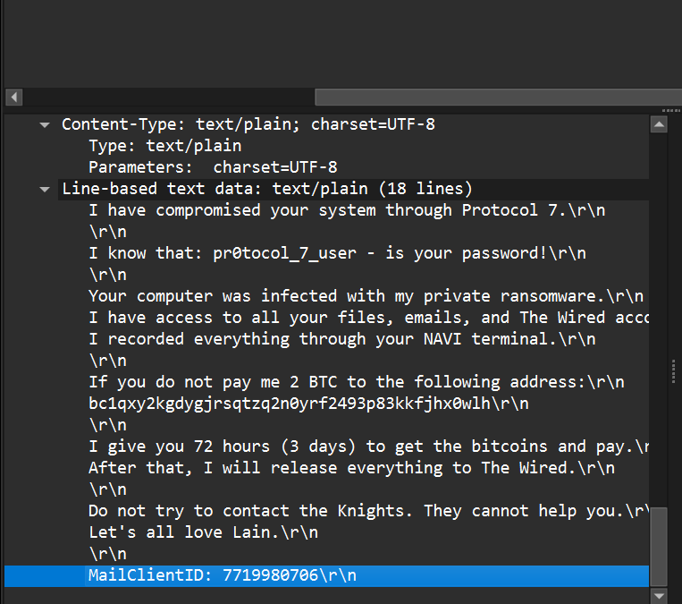

### 19.3 What type of malware did the attacker claim infected the victim's computer?
"Your computer was infected with my private ransomware.\r\n"

### 19.4 How many days deadline did the attacker give the victim to pay?
"I give you 72 hours (3 days) to get the bitcoins and pay.\r\n" 

### 19.5 What is the MailClientID specified at the bottom of the extortion email?
"MailClientID: 7719980706\r\n"

### 19. Flag
Dari kumpulan jawaban tersebut:

victim@protocol7.co.jp

pr0tocol_7_user

private ransomware

3

7719980706

Maka didapatkan flag: KOMJAR26{SMTP_Ext0rt10n_ZFLfjUJOsNM9wPysEm9m3ZIlt}

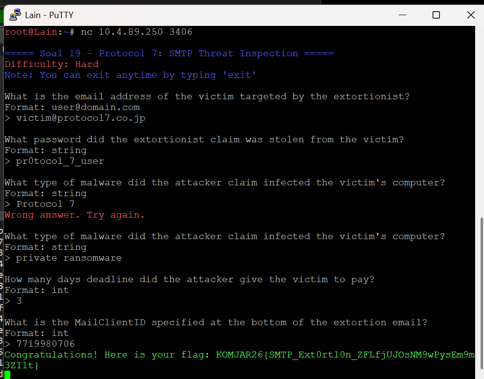


## 20.
### 20.1 What spesific TLS protocol version was negotiated for the encrypted communication?
Menggunakan filter `tls.handshake.type == 1`. Nilai `1` pada layer TLS Handshake secara universal merepresentasikan pesan `Client Hello`, paket pertama yang dikirimkan oleh client ke server saat ingin membangun HTTPS/TLS.

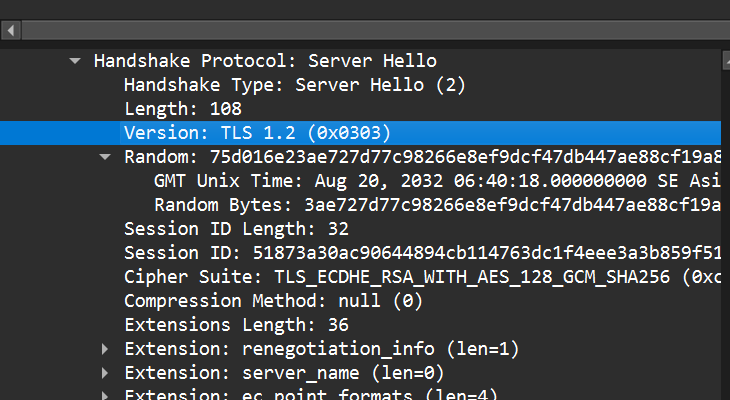

### 20.2 What domain name (SNI / Host) was requested by the client during the TLS handshake?
Dari hasil packet yang didapatkan pada 20.1 didapatkan juga domain nya.

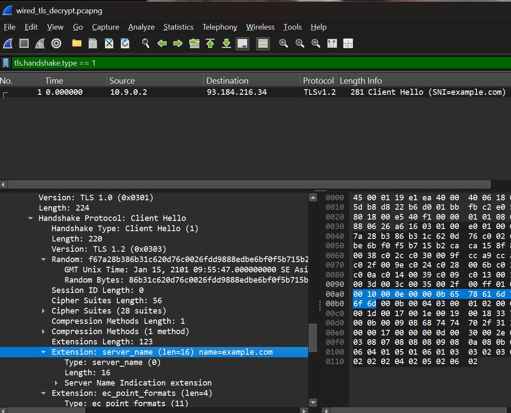

### 20.3 What is the IP address of the HTTPS server?
Karena port 443 adalah standar untuk komunikasi web HTTPS/TLS, filter `tcp.port == 443` untuk mendapatkan jawabannya. 

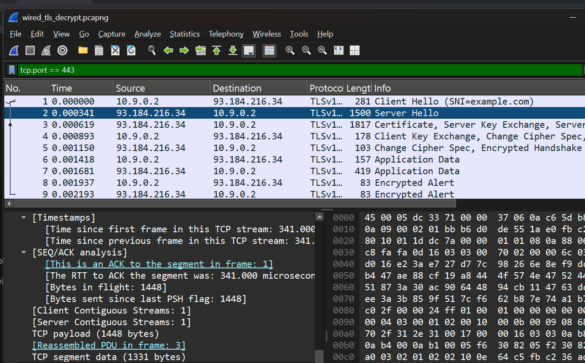

### 20.4 What User-Agent string was used by the client during the decrypted HTTP session?

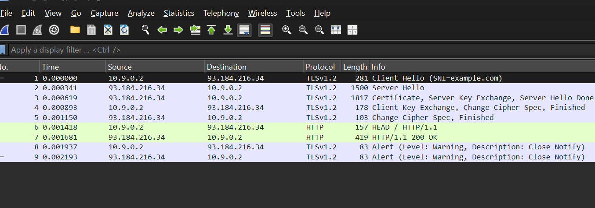

Pada gambar tersebut terlihat 2 packet dengan protocol HTTP. Karena sedang menganalisis client, maka cari informasi pada packet dengan IP destination yang telah didapat pada 20.3.

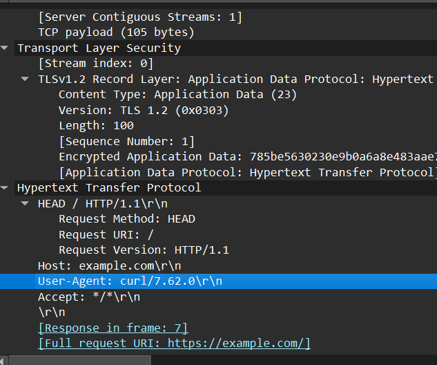

### 20.5 What HTTP request mehod and path was sent in the decrypted request?
Dari analisis 20.4 didapatkan juga jawaban untuk nomor ini. 

### 20. Flag
Dari kumpulan jawaban tersebut:

TLS 1.2

example.com

93.184.216.34

curl/7.62.0

HEAD /

Maka didapatkan flag: KOMJAR26{TLS_D3crypt_cTtcuYV9AqEArZEauyuYNJzim}

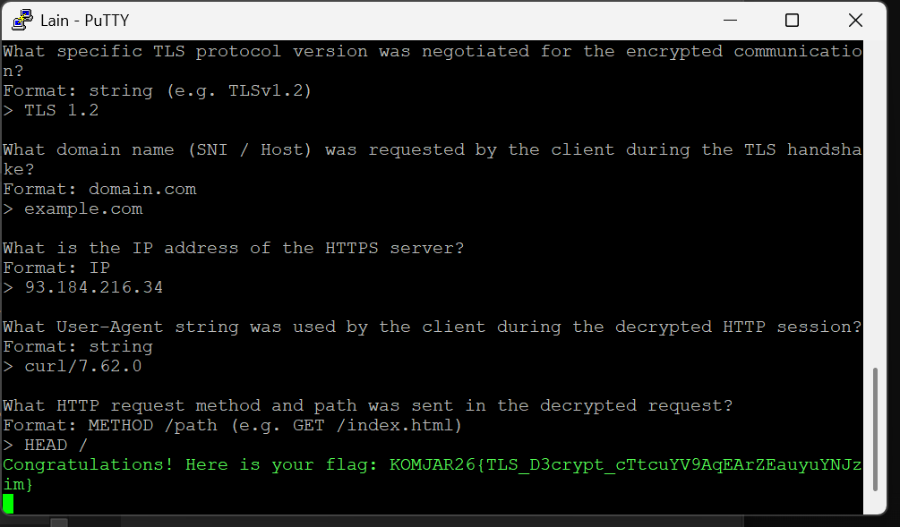